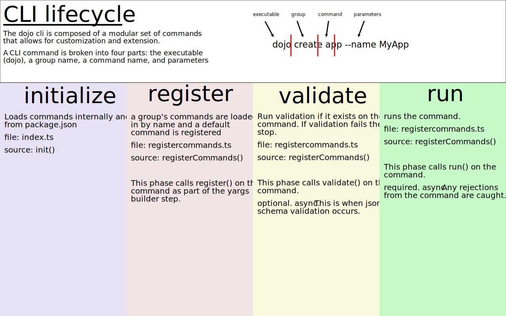

# Dojo CLI Architecture



## CLI Lifecycle

The dojo cli is composed of a modular set of commands that allows for customization and extension.

A CLI command is broken into four parts: the executable (dojo), a group name, a command name, and parameters

```
> dojo create app --name MyApp
```

### Initialize Phase

Loads commands internally and from package.json

### Register Phase

A group's commands are loaded in by name and a default command is registered.

This phase calls register() on the command as part of the yargs builder step.

### Validate Phase

Run validation if it exists on the command. If validation fails then stop.

This phase calls validate() on the command. This is where schema validation occurs.

## Run Phase

Runs the command.

This phase calls run() on the command.
